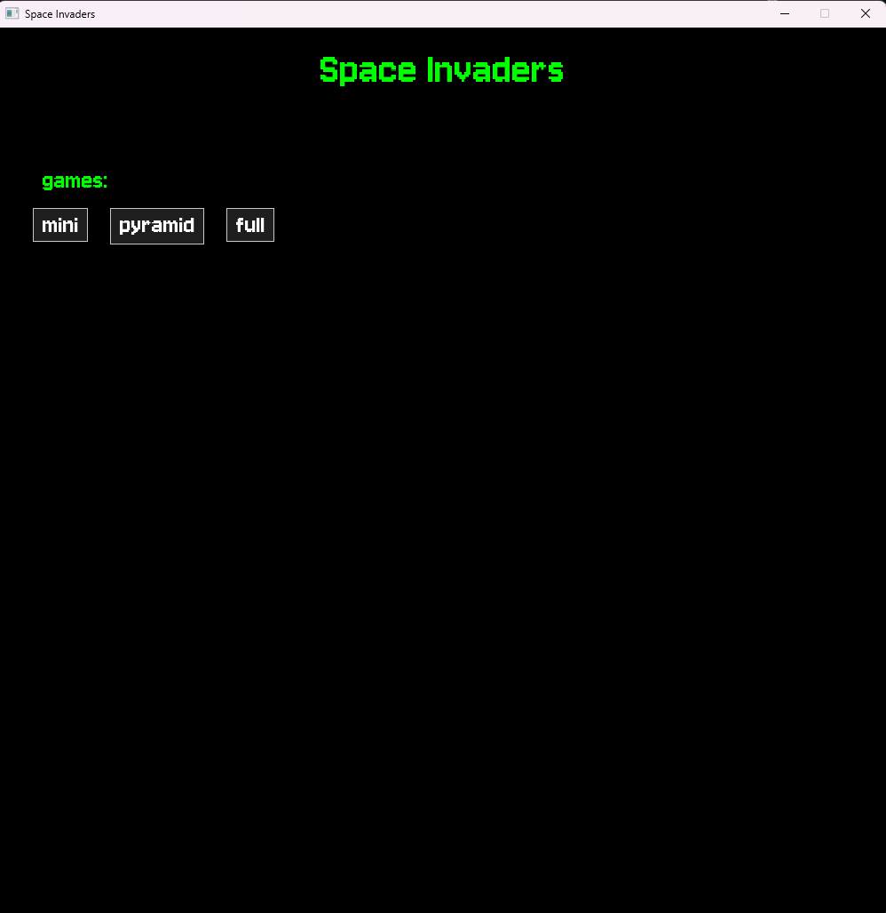
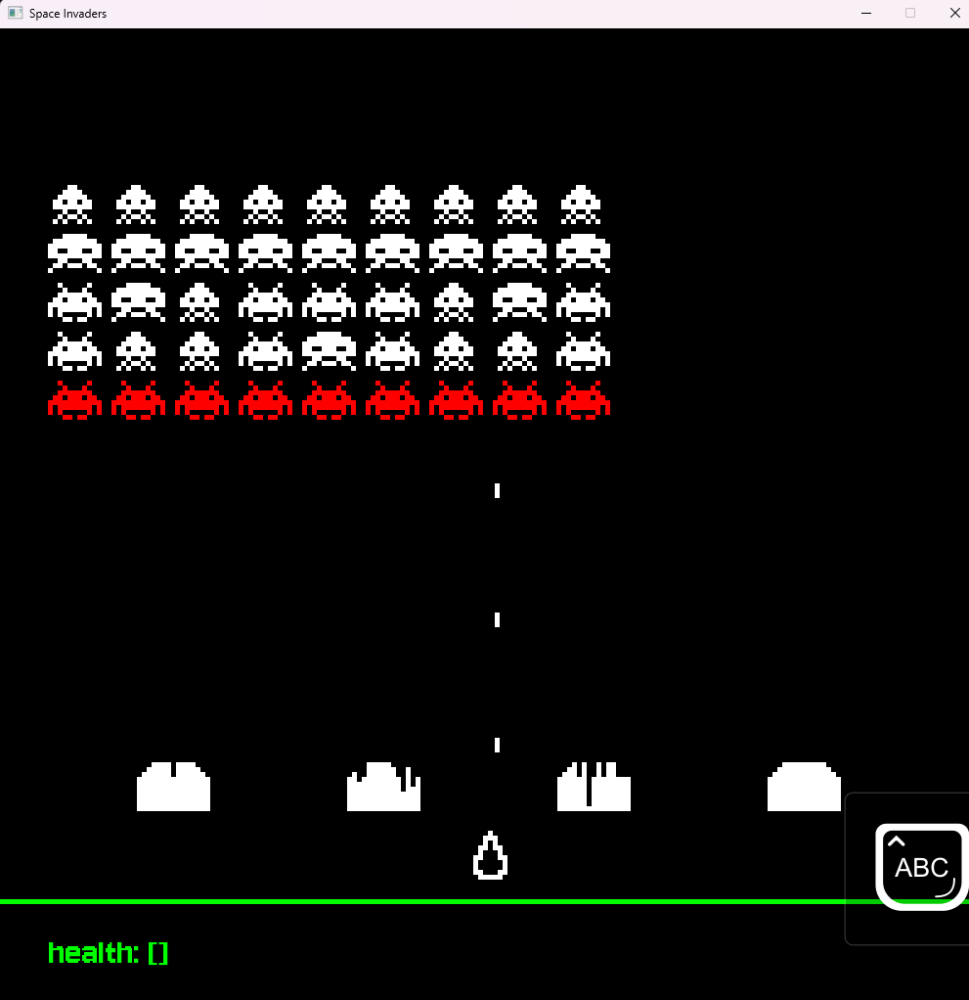
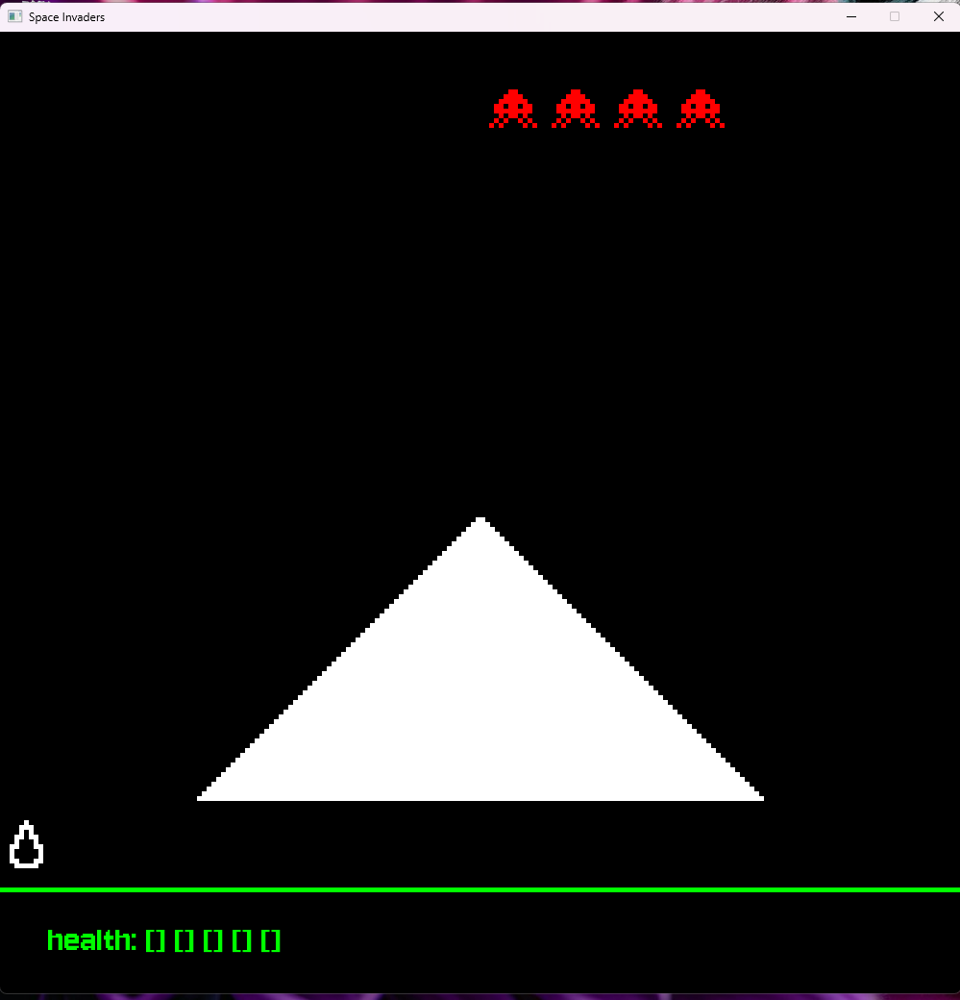

# Space Invaders
##### Opis: Projekt na algorytmikę i struktury danych.
projekt to gra space_invaders oparta na pliku konfiguracyjnym.
## zdjęcei z gry
menu funkcje:
- przemieszczanie przycisków scrollem
- wybór gier

gra:
- esc - wstrzymanie gry 



## Plik Konfiguracyjny
```toml
[Settings]
widthWindow = 1000
heightWindow = 1000
font = "Jersey10-Regular.ttf"

[Resources]
texture = [
    { name = "Robot", path = "robak.png" },
    { name = "Robot2", path = "robak2.png" },
    { name = "Alien1_1", path = "kosmita1_1.png" },
    { name = "Alien1_2", path = "kosmita1_2.png" },
    { name = "Alien2_1", path = "kosmita2_1.png" },
    { name = "Alien2_2", path = "kosmita2_2.png" },
    { name = "Spaceship", path = "statek.png" }
]

[Entity]
enemy = [
    { name = "v1", texture = "Robot;Robot2",health = 3 ,damage = 3, bulletSpeed = 400, bulletDelay = 3},
    { name = "v2", texture = "Alien1_1;Alien1_2",health = 8 ,damage = 5, bulletSpeed = 300, bulletDelay = 3},
    { name = "v3", texture = "Alien2_1;Alien2_2",health = 4 ,damage = 5, bulletSpeed = 600, bulletDelay = 1}
]

player = [
    { name = "level1", texture = "Spaceship",health = 10 ,damage = 3, bulletSpeed = 600, bulletDelay = 0.2},
    { name = "level2", texture = "Spaceship",health = 5 ,damage = 3, bulletSpeed = 500, bulletDelay = 0.1}
]

[Layout]
wall = [
    { name = "wall1", count = 4 ,x = 15, y = 10, height = 250, cut = 5},
    { name = "wall2", count = 2 ,x = 20, y = 10, height = 250, cut = 3},
    { name = "pyramid", count = 1 ,x = 180, y = 60, height = 500, cut = 2}
]

level = [
    { name = "level_V1", end = "next_level", player = "level1", playerSpeed = 400, enemySpeed = 200, wall = "wall1", layout = [
        ["v2","v2","v2","v2"],
        ["v1","v1","v1","v1"]
    ],lines = [10,60,110,160,210,260,310,360] },

    { name = "level_V2", end = "you won", player = "level1", playerSpeed = 400, enemySpeed = 300, wall = "wall2", layout = [
        ["v3","v2","v2","v3"]
    ],lines = [10,60,110,160,210,260,310,360] },

    { name = "level_pyramid", end = "-->>", player = "level2", playerSpeed = 600, enemySpeed = 500, wall = "pyramid", layout = [
        ["v3","v3","v3","v3"]
    ],lines = [10,60,110,160,210,260,310,360] },

    { name = "level_full", end = "-->>", player = "level1", playerSpeed = 400, enemySpeed = 200, wall = "wall1", layout = [
        ["v3","v3","v3","v3","v3","v3","v3","v3","v3"],
        ["v2","v2","v2","v2","v2","v2","v2","v2","v2"],
        ["v1","v2","v3","v1","v1","v1","v3","v2","v1"],
        ["v1","v3","v3","v1","v2","v1","v3","v3","v1"],
        ["v1","v1","v1","v1","v1","v1","v1","v1","v1"],
    ],lines = [10,60,110,160,210,260,310,360] }
]

game = [
    { name = "mini", levels = [
        "level_V1",
        "level_V2",
    ]},
    { name = "pyramid", levels = [
        "level_pyramid",
    ]},
    { name = "full", levels = [
        "level_full",
    ]}
]
```
### opis konfiguracji 

Ustawienie rozmiaru okna oraz fontu
```toml
[Settings]
widthWindow = 1000
heightWindow = 1000
font = "Jersey10-Regular.ttf"
```

lista texture
- name = nazwa używana do konfiguracji.
- path = ścieżka do pliku. (pliki są ładowane, dopiero jak są potrzebne)
```toml
[Resources]
texture = [
    { name = "Robot", path = "robak.png" },
    { name = "Robot2", path = "robak2.png" },
    { name = "Alien1_1", path = "kosmita1_1.png" },
    { name = "Alien1_2", path = "kosmita1_2.png" },
    { name = "Alien2_1", path = "kosmita2_1.png" },
    { name = "Alien2_2", path = "kosmita2_2.png" },
    { name = "Spaceship", path = "statek.png" }
]
```
lista przeciwników 
- name = nazwa używana do konfiguracji.
- texture = dwie nazwy tekstur oddzielone `;`
- health = zdrowie 
- damage = zadawane obradzenia
- bulletSpeed = Prędkość pocisku 
- bulletDelay = czas do wystrzelenia kolejnego pocisku. (pocisk zostaje wystrzelony dopiero, jeśli przeciwnik znajduje się nad graczem)
```toml
[Entity]
enemy = [
    { name = "v1", texture = "Robot;Robot2",health = 3 ,damage = 3, bulletSpeed = 400, bulletDelay = 3},
    { name = "v2", texture = "Alien1_1;Alien1_2",health = 8 ,damage = 5, bulletSpeed = 300, bulletDelay = 3},
    { name = "v3", texture = "Alien2_1;Alien2_2",health = 4 ,damage = 5, bulletSpeed = 600, bulletDelay = 1}
]
```
lista graczy
- name = nazwa używana do konfiguracji.
- texture = nazwa tekstury
- health = zdrowie
- damage = zadawane obradzenia
- bulletSpeed = Prędkość pocisku
- bulletDelay = czas do wystrzelenia kolejnego pocisku. (pocisk zostaje wystrzelony dopiero, jeśli przeciwnik znajduje się nad graczem)
```toml
[Entity]
player = [
    { name = "level1", texture = "Spaceship",health = 10 ,damage = 3, bulletSpeed = 600, bulletDelay = 0.2},
    { name = "level2", texture = "Spaceship",health = 5 ,damage = 3, bulletSpeed = 500, bulletDelay = 0.1}
]
```

lista ścian
- name = nazwa używana do konfiguracji.
- count = ilość ścian
- x/y = rozmiar
- height = wysokość, na której jest ściana 
- cut = kształt ściany. im mniejsza, tym bardziej ścięta.
```toml
[Layout]
wall = [
    { name = "wall1", count = 4 ,x = 15, y = 10, height = 250, cut = 5},
    { name = "wall2", count = 2 ,x = 20, y = 10, height = 250, cut = 3},
    { name = "pyramid", count = 1 ,x = 180, y = 60, height = 500, cut = 2}
]
```
lista poziomów 
- name = nazwa używana do konfiguracji.
- end = napis pojawiający się po przejściu levelu 
- player = nazwa gracza z konfigu.
- playerSpeed = prędkość poruszania się gracza.
- enemySpeed = prędkość poruszania się przeciwników.
- wall = nazwa ściany z konfigu.
- layout = siatka przeciwników. nazwy z konfigu.
- lines = lista wysokość, po których poruszają się przeciwnicy.
```toml
[Layout]
level = [
{ name = "level_V1", end = "next_level", player = "level1", playerSpeed = 400, enemySpeed = 200, wall = "wall1", layout = [
    ["v2","v2","v2","v2"],
    ["v1","v1","v1","v1"]
    ],lines = [10,60,110,160,210,260,310,360] }
]
```
lista gier
- name = nazwa używana do konfiguracji.
- levels = lista leveli. nazwy z konfigu.
```toml
[Layout]
game = [
    { name = "mini", levels = [
        "level_V1",
        "level_V2",
    ]},
    { name = "pyramid", levels = [
        "level_pyramid",
    ]},
    { name = "full", levels = [
        "level_full",
    ]}
]
```
## opis niektórych fragmentów kodu
są również komentarze w kodzie.
> [!IMPORTANT]
> Pierwsze co trzeba wyjaśnić to, czemu wszystkie pliki są `.h`. Jest tak dlatego,
> że w większość plików używam `template`[^1] a funkcje szablonowe muszą być w plikach nagłówkowych,
> ponieważ to dynamiczna cześć języka i nie można jej skompilować bez wiedzy, w jaki sposób chcemy jej użyć.

> [!IMPORTANT]
> w pliku [CMakeLists.txt](CMakeLists.txt) znajdują się informacje:
> 1. wersja cpp `set(CMAKE_CXX_STANDARD 23)`.
> 2. biblioteki, które użyłem.
>    - [`https://github.com/SFML/SFML.git`](https://www.sfml-dev.org/).
>    - [`https://github.com/marzer/tomlplusplus.git`](https://marzer.github.io/tomlplusplus/).

## Template[^1] + variadic template[^2] + Fold expressions[^3]
Przy pomocy wariadycznych szablonów można stworzyć funkcje, która przyjmuje cokolwiek np. [TomlReader.h](TomlReader.h)
```c++
template<std::invocable<toml::table>... Fs>
std::optional<std::tuple<std::invoke_result_t<Fs, toml::table>...> > create_form_toml(
    const std::string &filename, Fs... fs) {
    toml::table tbl;
    try {
        tbl = toml::parse_file(filename);
    } catch (const toml::parse_error &err) {
        return std::nullopt;
    }
    return std::make_tuple(fs(tbl)...);
}
```
Co ta funkcja robi. Bierze wielę funkcji, które potrafią się wywołać z parametrem `toml::table`. Zwraca `std::tupla` z wynikami wywołanych tych funkcji.<br/>

Można też nadpisywać funkcje tak, żeby funkcja mogła zareagować na różne typy.
```c++
template<typename T>
    static bool if_collided(T &target, Bullet &bullet) {
        return false;
    };

    template<CollisionObjectWith<Bullet> T>
    static bool if_collided(T &target, Bullet &bullet) {
        sf::FloatRect target_bounds = target.getBounds();
        if (bullet.getBounds().findIntersection(target_bounds).has_value()) {
            target.collision(bullet);
            return true;
        }
        return false;
    };

    template<typename T>
    static bool if_collided(std::vector<T> &target, Bullet &bullet) {
        for (auto it = target.begin(); it != target.end(); ++it) {
            if (if_collided(*it, bullet)) {
                if (tryRemove(*it)) {
                    target.erase(it);
                }
                return true;
            }
        }
        return false;
    };

    template<SmartOrRawPointer Ptr>
    static bool if_collided(Ptr &ptr, Bullet &bullet) {
        if (!ptr) return false;
        return if_collided(*ptr, bullet);
    }
```
Funkcja dla każdego nierozpoznanego typu przez inne przeciążenia zwraca false.
Jeżeli trafi na przeciążenie z wektorem rozpakuje i wywoła jeszcze raz tę funkcję w pętli.
Jeżeli ptr to rozpakuje i wywołuje jeszcze raz funkcje.
Jeżeli CollisionObjectWith<Bullet> to wywołuje już poprawne działanie funkcji.

## Concepts[^4]
Wszystkie koncepty, które napisałem, znajdują się w [concepts.h](concepts.h).
Pierwszy problem, który rozwiązałem za pomocą konceptów to rozwiązanie skomplikowanych `#include`.
Ponieważ w pliku [Player.h](Player.h) chciałem includować [Robot.h](Robot.h) i odwrotnie co stwarzało problem przez **header guard**[^5].
np. koncept `Shooter` posłużył mi do ukrycia klasy `Bullet_Controller<Player, std::vector<std::shared_ptr<Robot> >, std::vector<Wall> >::Buller_Helper` 

Oprócz tego można wziąć przez szablon i koncept do funkcji klasy obiekt, który spełnia kilka założeń np.
```c++
template<typename T>
concept UIElement =
        (CollisionObject<T> ||
        requires(const T &obj)
        {
            { obj.getGlobalBounds() } -> std::same_as<sf::FloatRect>;
        }) && std::derived_from<T,sf::Drawable>;
```
koncept jest spełniony, jeżeli spełnia koncept CollisionObject<T> lub ma metodę getGlobalBounds() która zwraca sf::FloatRect i musi dziedziczyć po sf::Drawable.<br/>

użycie [Button.h](Button.h)
```c++
template<UIElement T>
class Button : public sf::Drawable, public sf::Transformable
```

## Smart Pointers
Takie jak [std::unique_ptr](https://en.cppreference.com/w/cpp/memory/unique_ptr.html),
[std::shared_ptr](https://en.cppreference.com/w/cpp/memory/shared_ptr.html),
[std::weak_ptr](https://en.cppreference.com/w/cpp/memory/weak_ptr.html).
użyłem ich do przechowywania wrogów i informacji na temat wierszy.
```c++
std::vector<std::shared_ptr<Robot> > current_enemy // przechowywanie
std::vector<std::vector<std::weak_ptr<Robot> > > enemy_line // wiersze
```
Przez to, że przechowywałem dodatkowe `weak_ptr` jako ilustracja wierszy wrogów nie musiałem filtrować po tablicy robotów a po prostu iterowałem po wierszach.

## Algorytmy `std`,`std::ranges`,`std::views`
Różnice: algorytmy z `std` przyjmują dwa iteratory a algorytmy `std::ranges` przyjmują kontenery. Trzeba też powiedzieć, że nie są ze sobą do końca kompatybilne.
`std::views` to zupełnie coś innego, ponieważ wykonuje się leniwie, a zatem stworzenie takiego obiektu jest bardzo tanie i dopiero przy iteracji wykonuje np. filtrowanie.

## [Lazy.h](Lazy.h)
w tym pliku jest mała klasa. Dzięki niej mogę np. ładować tekstury leniwie `std::map<std::string, Lazy<Load_Texture> > &textures_;`.
```c++
template<typename F>
    requires std::invocable<F>
class Lazy {
public:
    using T = std::invoke_result_t<F>;
private:
    std::optional<T> instance{};
    F function{};
public:
    Lazy() = default;
    explicit Lazy(const F &fn) : function(fn) {
    }
    explicit Lazy(F &&fn) : function(std::move(fn)) {
    }
    T &get() {
        if (!instance) {
            instance = std::invoke(function);
        }
        return *instance;
    }
    operator T &() { return get(); }
};
```

[^1]:[template](https://en.cppreference.com/w/cpp/language/templates.html)
[^2]:[variadic template](https://en.cppreference.com/w/cpp/language/parameter_pack.html)
[^3]:[Fold expressions](https://en.cppreference.com/w/cpp/language/fold.html)
[^4]:[Concepts](https://en.cppreference.com/w/cpp/concepts.html)
[^5]:header guard występuje na początku pliki i dba, żeby plik nie wkleił sie dwa razy. 
`
#ifndef SPACE_INVADERS_ROBOT_H
#define SPACE_INVADERS_ROBOT_H
`

